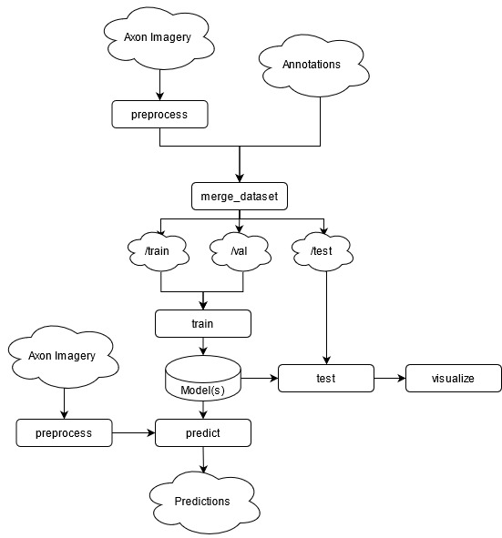

[](https://opensource.org/licenses/BSD-2-Clause)
# Axon Centerline Detection
Toolbox for segmentation and centerline detection in axon imagery. 

As advances in microscopy imaging provide an ever clearer window into the human brain, accurate reconstruction of neural connectivity can yield valuable insight into the relationship between brain structure and function. However, human manual tracing is a slow and laborious task, and requires domain expertise. Automated methods are thus needed to enable rapid and accurate analysis at scale. This toolbox implements deep neural networks for dense axon tracing while incorporating axon topological information into the loss function with a goal to improve the performance on both voxel-based segmentation and axon centerline detection. We evaluated three models using a modified 3D U-Net architecture trained on a mouse brain dataset imaged with light sheet microscopy and achieved a 10% increase in axon tracing accuracy over previous methods.

## Setting up the environment
Install dependencies using Anaconda from `requirements.yaml`. From the cloned directory, run the following commands:

```
conda env create -f requirements.yaml
conda activate axcend
```

## Workflow



### Preprocessing

- Preprocess raw axon imagery (TIFF, HDF5, Imaris, or Zarr) using `axcend/preprocess.py`
- Merge the preprocessed imagery with ground truth data using `axcend/merge_dataset.py`
  - Imagery and ground truth should be the same dimensions; if not, the ground truth will be cropped
  - The default datatypes (e.g. dtype1=`float32` and `--dtype2=uint8`) should be used for binary ground truth
  - Note that this will automatically scale ground truth between 0 and 1

### Training and inference

- Manually split the dataset into `train`, `val`, and `test` files, and create a config file specifying the model to be trained
- Run an experiment using `axcend/train.py`
- Evaluate results on the test set using `axcend/test.py`
  - If the `-s` flag is used, results will be saved
- Generate predictions on new data using `axcend/predict.py`

### Post-processing

- `axcend/merge_dataset.py` can be used convert datatypes
  - axcend works on floating point arrays, but it's a good idea to convert imagery to `uint16` (i.e. `--dtype1=uint16`) to reduce memory usage
  - use `--dtype2=float32` to convert binary annotations

## Running a job

Training should be done on a GPU.

```
# Train one model, redirect output to nohup.out
nohup python -u axcend/train.py configs/cldice.yaml -r 1 &

# By default, slurm logs will be output to ./logs so make sure this directory exists
mkdir logs
```

## Usage

```
python axcend/train.py [-h] [--schema SCHEMA] [--weights_dir WEIGHTS_DIR] [--results_dir RESULTS_DIR] [-r REPEAT] [-v] config

Train 3D U-Net.

positional arguments:
  config                YAML containing experiment and model specification

optional arguments:
  -h, --help            show this help message and exit
  --schema SCHEMA       YAML containing schema to validate config
  --weights_dir WEIGHTS_DIR
                        Directory containing saved models
  --results_dir RESULTS_DIR
                        Directory where results and checkpoints will be stored
  -r REPEAT, --repeat REPEAT
                        Number of times to run experiment.
  -v, --verbose
  ```

```
python axcend/predict.py [-h] [--schema SCHEMA] [--weights_dir WEIGHTS_DIR] [-f FILENAME] [-o OUTPUT_PATH] config

Perform inference on a new dataset.

positional arguments:
  config                YAML containing experiment and model specification
  output                Path to output dataset.

optional arguments:
  -h, --help            show this help message and exit
  --schema SCHEMA       YAML containing schema to validate config
  --weights_dir WEIGHTS_DIR
                        Directory containing saved models
  -f FILENAME, --filename FILENAME
                        File containining checkpointed model (optional)                        
```

```
axcend/test.py [-h] [--schema SCHEMA] [--weights_dir WEIGHTS_DIR] [--results_dir RESULTS_DIR] [-f FILENAME] [-b]
             [-o OUTPUT_FILE] [-s] [-t] [-v]
             config

Generate and evaluate predictions on test set.

positional arguments:
  config                YAML containing experiment and model specification

optional arguments:
  -h, --help            show this help message and exit
  --schema SCHEMA       YAML containing schema to validate config
  --weights_dir WEIGHTS_DIR
                        Directory containing saved models
  --results_dir RESULTS_DIR
                        Directory where results and checkpoints will be stored
  -f FILENAME, --filename FILENAME
                        File containing checkpointed model (optional)
  -b, --use-best        Use best weights rather than final weights.
  -o OUTPUT_FILE, --output-file OUTPUT_FILE
  -s, --save-results    Output a file containing predictions.
  -t, --use-test-time-augmentation
  -v, --verbose
```

```
usage: preprocess.py [-h] [--key KEY] input output

Preprocess raw imagery.

positional arguments:
  input       Path to input file.
  output      Path to output file.

optional arguments:
  -h, --help  show this help message and exit
  --key KEY   Name of dataset (if HDF5
```

```
usage: merge_dataset.py [-h] [--key1 KEY1] [--dtype1 DTYPE1] [--key2 KEY2] [--dtype2 DTYPE2] input1 input2 output

Merge imagery and ground truth into one dataset file.

positional arguments:
  input1           Path to raw imagery.
  input2           Path to ground truth data.
  output           Path to output file.

optional arguments:
  -h, --help       show this help message and exit
  --key1 KEY1      Key for raw imagery
  --dtype1 DTYPE1  Data type for raw imagery
  --key2 KEY2      Key for ground truth data
  --dtype2 DTYPE2  Data type for ground truth
```

## helpful commands
```
jobs                ->      shows what jobs are currently running
kill %<job #>       ->      terminates the job specified
&                   ->      runs job in background so you can continue using command line prompt
```

## Disclaimer
© 2023 Massachusetts Institute of Technology.

The software/firmware is provided to you on an As-Is basis

## Citation
[](https://zenodo.org/badge/latestdoi/634872912)

